# RAG (Retrieval-Augmented Generation) Report

# 1. RAG আসলে কী?

RAG হলো এমন একটি architecture যেখানে একটি Large Language Model (LLM) উত্তর তৈরি করার আগে external knowledge source থেকে প্রয়োজনীয় তথ্য retrieve করে এবং সেই তথ্যকে context হিসেবে ব্যবহার করে উত্তর তৈরি করে।


### Example

ধরা যাক একটি কোম্পানির knowledge base-এ আছে:

```text
employee-handbook.pdf
company-policy.pdf
product-documentation.pdf
pricing.pdf
```

User প্রশ্ন করল:

> "How many annual leave days do employees receive?"

RAG system:

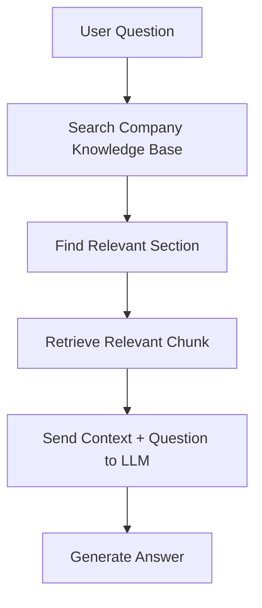

সম্ভাব্য answer:

> "According to the employee handbook, employees receive 20 days of annual leave per year."

এখানে LLM-এর মূল কাজ হলো retrieved information ব্যবহার করে উত্তর তৈরি করা।

---

# 2. কেন RAG দরকার?

একটি সাধারণ LLM অনেক ধরনের knowledge ধারণ করতে পারে, কিন্তু application-specific knowledge-এর ক্ষেত্রে সীমাবদ্ধতা থাকে।

## 2.1 Private / Proprietary Data

একটি company's private information সাধারণত public LLM knowledge-এর অংশ নয়।

যেমন:

```text
Internal HR Policy
Internal API Documentation
Customer Support Knowledge Base
Company Pricing
Internal SOP
Private Product Documentation
```

RAG ব্যবহার করে এই information external knowledge base-এ রাখা যায় এবং প্রয়োজন অনুযায়ী retrieve করা যায়।

## 2.2 Frequently Changing Information

কিছু information নিয়মিত পরিবর্তিত হয়।

যেমন:

```text
Product Price
Inventory
Company Policy
Product Documentation
FAQ
Service Availability
```

## 2.3 Grounded Answers

LLM কখনো এমন information generate করতে পারে যার কোনো বাস্তব source নেই। RAG-এর মাধ্যমে relevant context LLM-কে দেওয়া যায়।


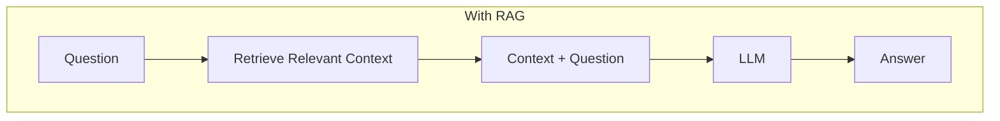

## 2.4 Source-based Answers

একটি ভালো RAG application answer-এর সাথে source information-ও দিতে পারে।

Example:

```text
Answer:
Employees receive 20 days of annual leave per year.

Source:
employee-handbook.pdf
Page: 12
```

এটি enterprise application-এর জন্য গুরুত্বপূর্ণ, কারণ user answer-এর source verify করতে পারে।

---

# 3. RAG-এর মূল Architecture

RAG architecture-কে মূলত দুইটি flow হিসেবে বোঝা যায়:

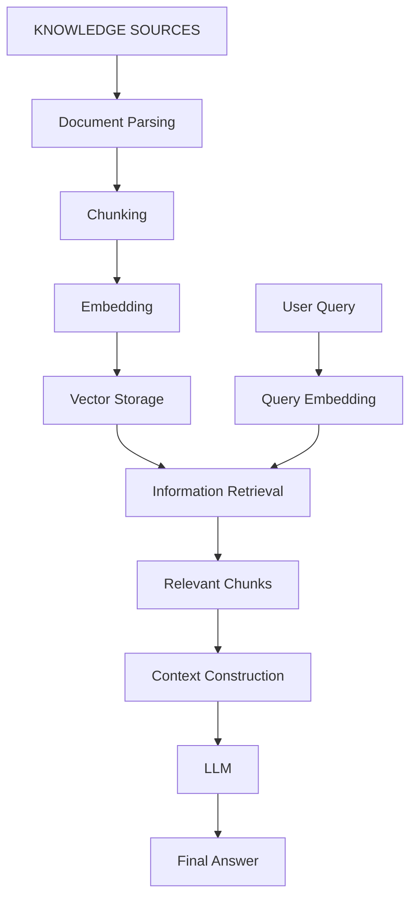

---

# 4. RAG-এর দুইটি প্রধান Phase 

## Phase A — Indexing / Ingestion

Indexing phase-এর উদ্দেশ্য হলো raw knowledge source-কে এমনভাবে প্রস্তুত করা যাতে পরবর্তীতে দ্রুত এবং relevant information retrieve করা যায়।

সাধারণ flow:

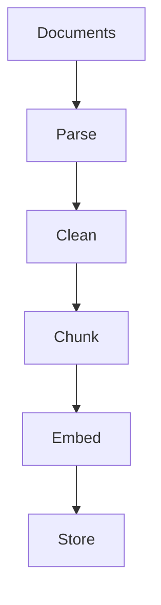

Example:

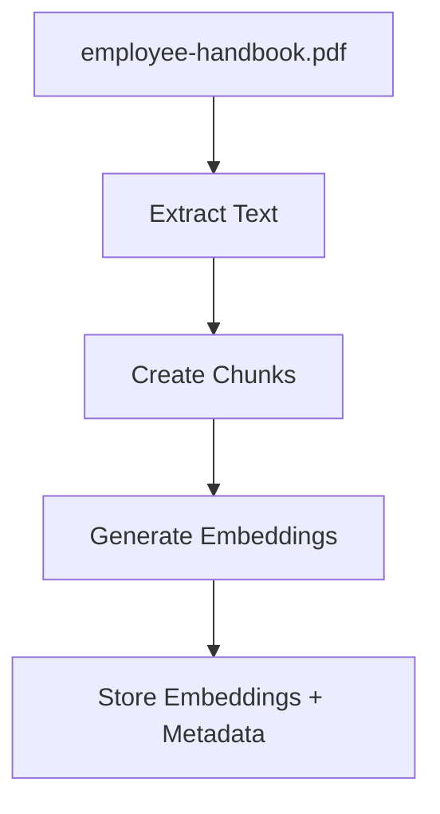

এই phase সাধারণত document প্রথমবার system-এ যোগ করার সময় অথবা document update হলে চলে।

---

## Phase B — Retrieval + Generation

User যখন প্রশ্ন করে, তখন query phase শুরু হয়।

Flow:

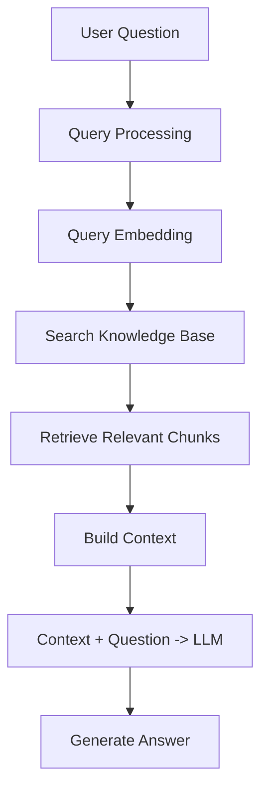

এখানে মূল কাজ হলো:

> User-এর প্রশ্নের উত্তর দেওয়ার জন্য knowledge base-এর কোন অংশ প্রয়োজন তা খুঁজে বের করা।

---

# 5. RAG Process

RAG-এর complete process কয়েকটি ধাপে বোঝা যায়:

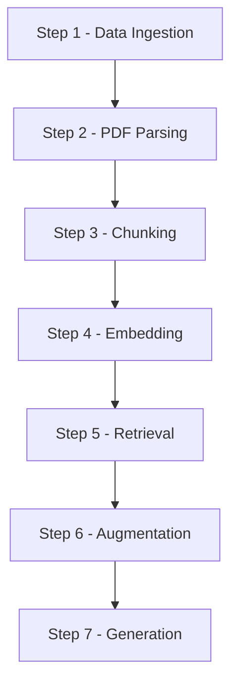

---

# 6. Step 1 — Data Ingestion

Data ingestion বলতে বিভিন্ন knowledge source-কে RAG system-এর মধ্যে আনা এবং processing-এর জন্য প্রস্তুত করাকে বোঝায়।

Possible sources:

```text
PDF
DOCX
TXT
Markdown
HTML
Web Pages
Database
API
Google Drive
Notion
GitHub
Images
```


---

# 7. Step 2 — PDF Parsing

PDF parsing হলো PDF file থেকে usable information বের করে আনা।

একটি PDF-এর মধ্যে থাকতে পারে:

```text
Text
Tables
Images
Headers
Footers
Page Numbers
Formatting
Layout Information
```

Basic parsing flow:

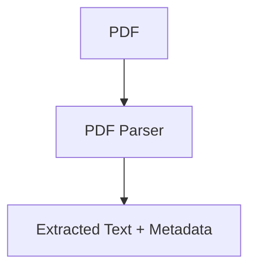

Example:

```json
{
  "text": "Employees are entitled to 20 days of annual leave...",
  "page": 12,
  "document": "employee-handbook.pdf"
}
```

Parsing-এর output পরবর্তী ধাপের input হিসেবে ব্যবহার করা হয়।

---

# 8. Step 3 — Chunking

একটি সম্পূর্ণ document সাধারণত retrieval-এর জন্য একটিমাত্র বড় block হিসেবে ব্যবহার করা হয় না।

Document-কে ছোট ছোট অংশে ভাগ করা হয়। এই অংশগুলোকে **chunk** বলা হয়।

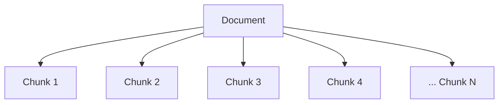

Chunking-এর মূল উদ্দেশ্য:

- Information-কে manageable করা
- Relevant অংশ retrieve করা
- Context quality বজায় রাখা
- Unnecessary token usage কমানো

---

# 9. কেন Chunking গুরুত্বপূর্ণ?

ধরা যাক একটি PDF-এ 100 pages আছে।

User প্রশ্ন করল:

> "How many annual leave days are available?"

এখানে পুরো 100 pages LLM-এর কাছে পাঠানোর প্রয়োজন নেই।

Relevant section যথেষ্ট:

```text
Employees receive 20 days of annual leave per year.
```

তাই:

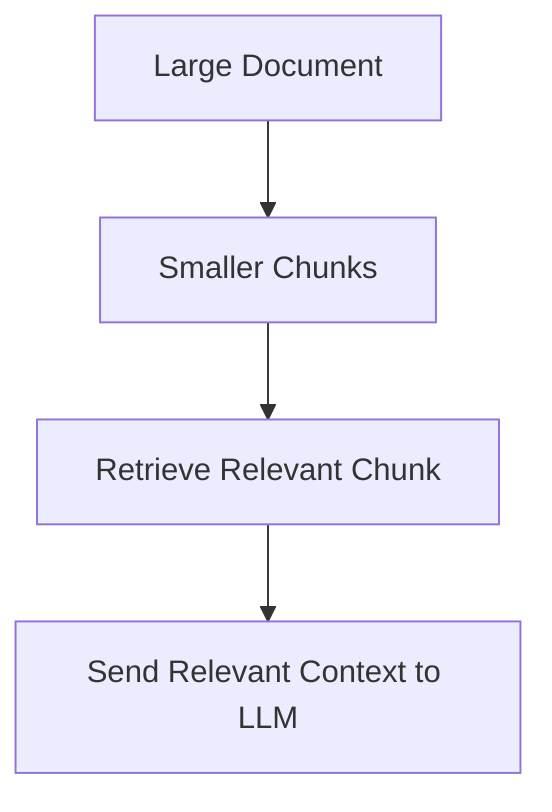

খারাপ chunking হলে retrieval ভালো হলেও relevant context পাওয়া নাও যেতে পারে।

---

# 10. Chunking Strategies

চারটি basic chunking strategy বোঝা গুরুত্বপূর্ণ:

```text
1. Fixed-size Chunking
2. Overlapping Chunking
3. Semantic Chunking
4. Hierarchical Chunking
```

## 10.1 Fixed-size Chunking

Fixed-size chunking-এ নির্দিষ্ট size অনুযায়ী document ভাগ করা হয়।

Example:

```text
Chunk Size = 500 tokens
```

তাহলে:

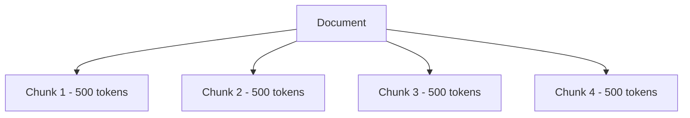

### সুবিধা

- Implement করা সহজ
- Predictable
- Size control করা সহজ

### সমস্যা

Sentence বা concept মাঝখানে split হয়ে যেতে পারে।

Example:

```text
Chunk 1:
Employees are entitled to 20 days of annual

Chunk 2:
leave per year...
```

এখানে একটি complete idea দুইটি chunk-এ ভাগ হয়ে গেছে।


## 10.2 Overlapping Chunks

Chunk boundary problem কমানোর জন্য overlapping chunks ব্যবহার করা যায়।

Example:

```text
Chunk 1 = Token 1–500
Chunk 2 = Token 400–900
Chunk 3 = Token 800–1300
```

এখানে neighbouring chunks-এর মধ্যে কিছু অংশ overlap করে।

Conceptually:

```text
Chunk 1
[--------------------]

          Chunk 2
          [--------------------]

                    Chunk 3
                    [--------------------]
```

### সুবিধা

- Boundary information preserve করতে সাহায্য করে
- Sentence/context split হওয়ার সম্ভাবনা কমে

### সমস্যা

- বেশি storage প্রয়োজন
- বেশি embeddings তৈরি হয়
- Processing cost বাড়তে পারে
- Duplicate information retrieval হতে পারে

## 10.3 Semantic Chunking

Semantic chunking token count-এর পরিবর্তে meaning বা logical structure অনুযায়ী document ভাগ করে।

Example:

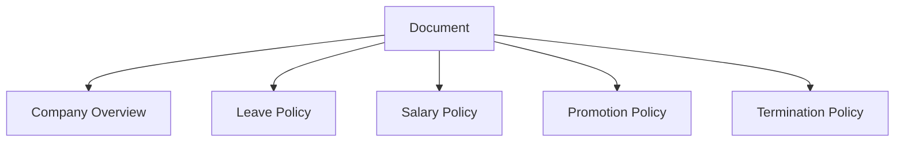

এখানে প্রতিটি meaningful section আলাদা chunk বা chunk group হতে পারে।

### সুবিধা

- Meaning preserve করা সহজ
- Context বেশি coherent হয়
- Structured documents-এর জন্য useful

### সমস্যা

- Implementation বেশি complex
- Semantic boundary নির্ধারণের জন্য অতিরিক্ত logic প্রয়োজন


## 10.4 Hierarchical Chunking

Hierarchical chunking document-এর structure বা hierarchy preserve করে।

Example:

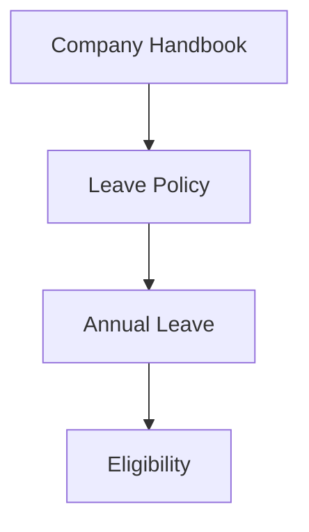

আরও বড় structure:

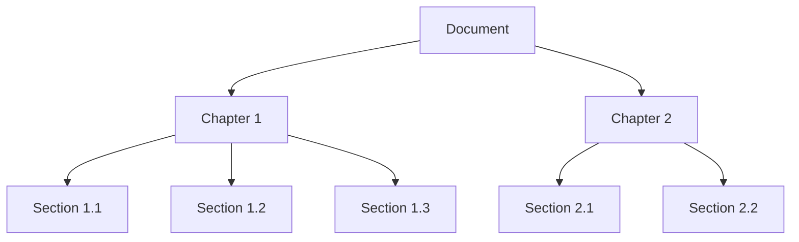

এই hierarchy metadata বা context হিসেবে preserve করা যেতে পারে।

এটি complex বা highly structured documents-এর ক্ষেত্রে useful।

---

# 11. Step 4 — Embedding

Embedding হলো text-এর semantic meaning-কে একটি numerical vector representation-এ রূপান্তর করার প্রক্রিয়া।

Example:

```text
"How many annual leave days do employees get?"
```

Conceptually এর embedding হতে পারে:

```text
[0.021, -0.183, 0.742, 0.091, ...]
```

আরেকটি semantically similar sentence:

```text
"Employees receive 20 vacation days per year."
```

এর vector-ও একই ধরনের semantic space-এ relatively কাছাকাছি হতে পারে।

মূল উদ্দেশ্য হলো exact keyword match নয়, বরং **semantic similarity** ব্যবহার করে relevant information খুঁজে বের করা।

---

# 12. Embedding কেন প্রয়োজন?

ধরা যাক document-এ লেখা:

> "Employees receive 20 vacation days per year."

কিন্তু user প্রশ্ন করল:

> "How much time off can I take?"

এখানে exact word match নেই।

তবুও দুইটির meaning কাছাকাছি:

```text
vacation
annual leave
time off
holiday
```

Embedding এই semantic relationship capture করতে সাহায্য করে।

Flow:

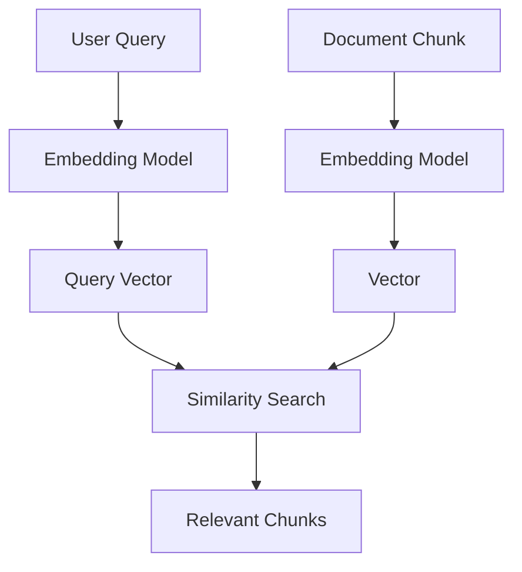

---

# 13. Vector Storage

Embedding তৈরি করার পরে এগুলো searchable storage-এ রাখা হয়।

Common options:

```text
PostgreSQL + pgvector
Qdrant
Pinecone
Weaviate
Milvus
Elasticsearch / OpenSearch
FAISS
```

একটি record conceptually এমন হতে পারে:

```json
{
  "id": "chunk_102",
  "embedding": [0.12, -0.43, 0.88],
  "text": "Employees receive 20 days...",
  "metadata": {
    "document": "employee-handbook.pdf",
    "page": 12,
    "department": "HR"
  }
}
```

এখানে তিনটি বিষয় গুরুত্বপূর্ণ:

```text
Embedding
Text
Metadata
```

Embedding search-এর জন্য, original text context তৈরির জন্য এবং metadata filtering/source tracking-এর জন্য ব্যবহার করা যায়।

---

# 14. Retrieval

Retrieval হলো user-এর query অনুযায়ী knowledge base থেকে relevant information খুঁজে বের করার প্রক্রিয়া।

Flow:

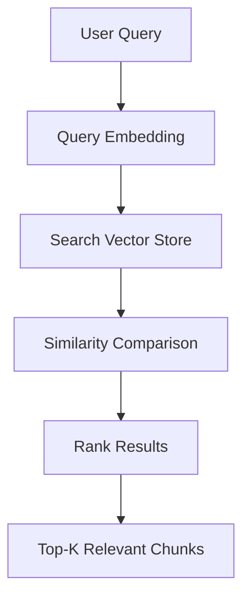

Example:

```text
1. Chunk 102 → 0.94
2. Chunk 88  → 0.91
3. Chunk 301 → 0.86
4. Chunk 77  → 0.81
5. Chunk 410 → 0.79
```

এখানে similarity score যত বেশি, সাধারণভাবে chunk-টি query-এর সাথে তত বেশি relevant।

---

# 15. Top-K Retrieval

Top-K বলতে retrieval-এর পরে কতগুলো relevant result রাখা হবে তা বোঝায়।

যদি:

```text
top_k = 5
```

তাহলে system 5টি relevant chunk নির্বাচন করতে পারে।

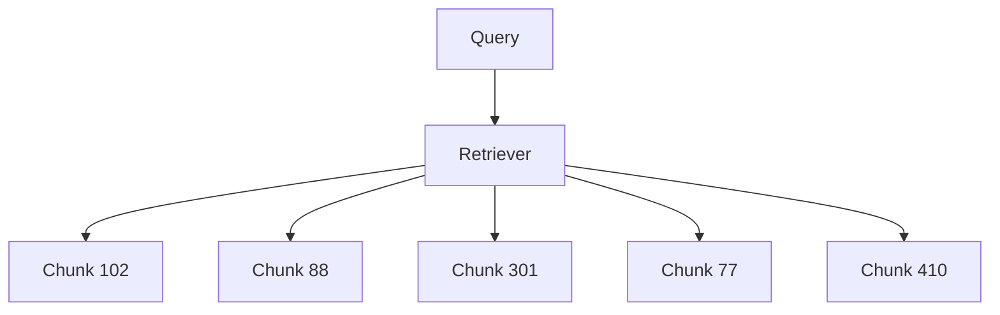

তবে `top_k` সবসময় একটি fixed universal value নয়।

Dataset, chunk size, question type এবং context window অনুযায়ী এটি tune করতে হয়।

---

# 16. Step 5 — Augmentation

Retrieval-এর মাধ্যমে relevant information পাওয়ার পরে সেই information LLM-এর input-এর সাথে যুক্ত করা হয়।

Example:

```text
System Instruction:
Answer using the provided context.

Context:
Employees are entitled to 20 days of annual leave per year.

Question:
How many annual leave days do employees get?
```

এখানে:

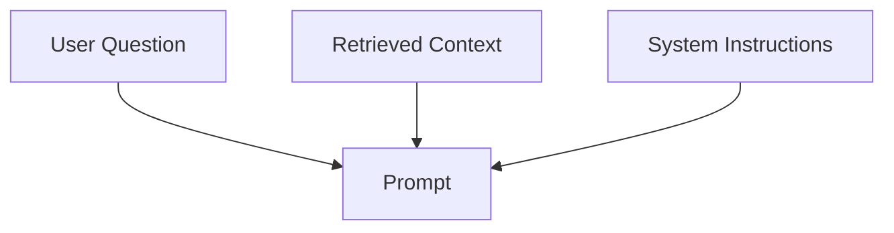

তৈরি হচ্ছে।

এটাই Augmentation stage।

---

# 17. Step 6 — Generation

Generation হলো LLM-এর মাধ্যমে final answer তৈরি করার ধাপ।

LLM input:

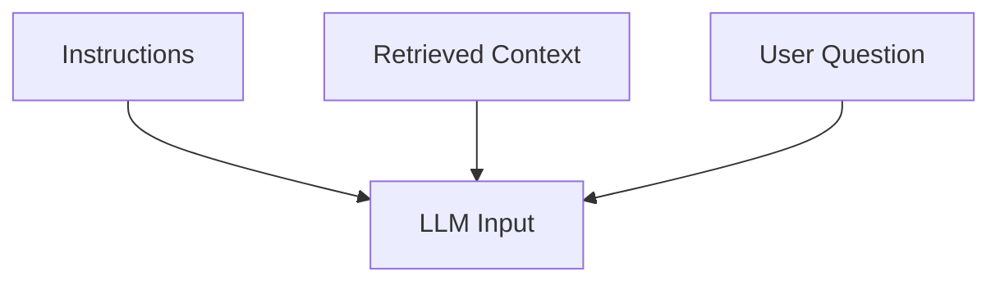

Output:

> "Employees are entitled to 20 days of annual leave per year."

এখানে LLM-এর দায়িত্ব হলো retrieved information ব্যবহার করে coherent এবং useful natural-language response তৈরি করা।

---

# 18. RAG বনাম Fine-Tuning

RAG এবং Fine-Tuning একই কাজ করে না।

দুটির উদ্দেশ্য আলাদা।

---

## 18.1 RAG

RAG-এ knowledge model-এর বাইরে থাকে।

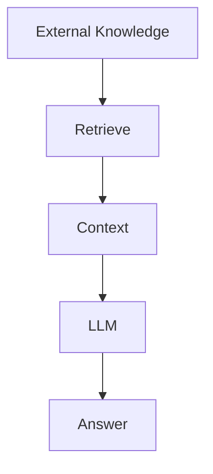

RAG সাধারণত useful যখন:

- Private documents নিয়ে কাজ করতে হবে
- Data frequently পরিবর্তিত হয়
- Company knowledge base তৈরি করতে হবে
- Source/citation প্রয়োজন
- Large document collection থেকে answer দিতে হবে

## 18.2 Fine-Tuning

Fine-tuning-এর মাধ্যমে model-কে additional training data দিয়ে তার behavior বা task performance পরিবর্তন করা হয়।

Conceptually:

```mermaid
flowchart TD
    A["Base Model"] --> B["Additional Training"]
    B --> C["Fine-Tuned Model"]
```

Fine-tuning useful হতে পারে:

- Specific response style
- Specific behavior
- Specialized task
- Domain-specific patterns

---

# 19. আমি RAG সম্পর্কে যা বুঝেছি

RAG শুধুমাত্র PDF upload করে LLM-কে প্রশ্ন করার ব্যবস্থা নয়। এটি একটি complete information retrieval এবং generation pipeline।

আমার বোঝাপড়া অনুযায়ী:

```text
1. Knowledge source সংগ্রহ করা হয়।
2. Document parse করে usable content তৈরি করা হয়।
3. বড় document ছোট meaningful chunk-এ ভাগ করা হয়।
4. প্রতিটি chunk-এর embedding তৈরি করা হয়।
5. Embedding, text এবং metadata searchable storage-এ রাখা হয়।
6. User-এর question process করা হয়।
7. Question-এর জন্য relevant information retrieve করা হয়।
8. Retrieved information context হিসেবে LLM-এর input-এর সাথে যুক্ত করা হয়।
9. LLM context এবং question ব্যবহার করে answer generate করে।
10. প্রয়োজন হলে source information-ও response-এর সাথে দেখানো যায়।
```